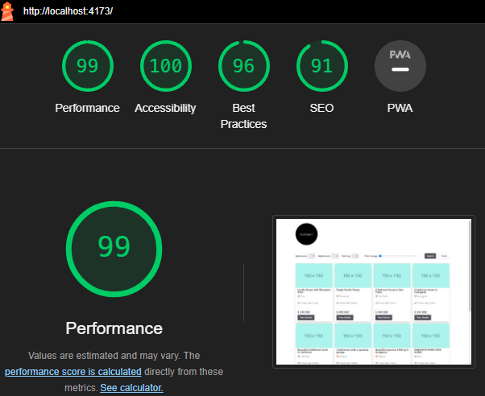
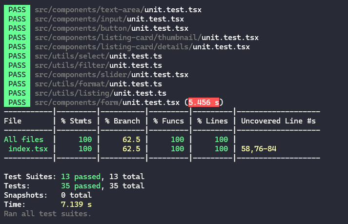

### Frontend-assessment

---

This React project was built using Vite, a fast and lightweight build tool.

## ✔️ Practices used in the project

- Conventional Commits: The project adheres to conventional commit messages, making version control and changelog generation more organized.
- Decoupling: Components, services, and modules are decoupled, promoting maintainability and scalability.
- Clean Architecture: The project follows clean architecture principles, separating business logic from infrastructure concerns.
- Componentization: UI components are modular, reusable, and encapsulated, enhancing code quality and readability.
- Composition Pattern: More complex components are composed, promoting reusability and testability.
  
# 🛠️ Tools, libraries and frameworks

- Testing: The project includes unit tests using the Jest and React Testing Library.
- Typescript: enhances code quality and productivity by providing typing and early error detection.
- Styling: Tailwindcss framework  - stands out for its utility-first approach, which promotes rapid development, consistency, and ease of maintenance.
- SEO: react-helmet-async library - easy to modify metadata in a React app

# 📁 Folder Structure

- src/
      - components/: Reusable UI components and their unit tests
      - hooks/context/: Context api
      - pages/: Top-level app pages
      - pages/_layouts: Layout for the app
      - utils/: Helper functions and utilities
        App.tsx: Main app entry point

